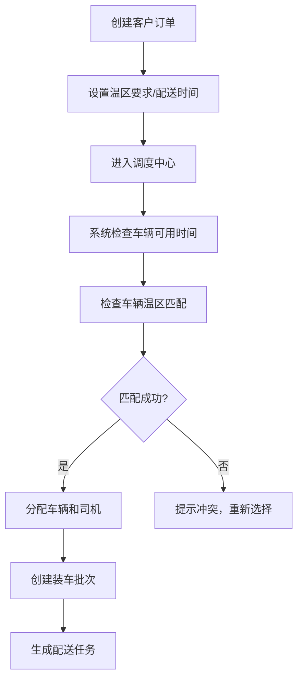
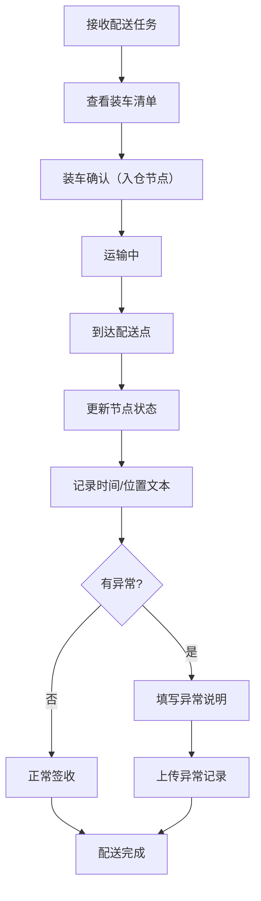
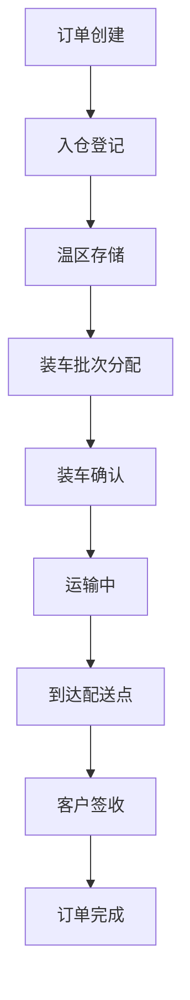

## 1. 产品概述

本系统是专为小型冷链配送公司设计的后端管理平台，用于管理冷链物流的全流程，从订单创建到最终签收的完整追踪。解决冷链配送中温区匹配、车辆调度、节点追踪等核心痛点，提升配送效率和货物安全性。

- 核心用户：调度员、司机、运营管理人员
- 核心价值：实现冷链配送全流程可视化、温区智能匹配、异常实时记录

## 2. 核心功能

### 2.1 用户角色

| 角色 | 注册方式 | 核心权限 |
|------|----------|----------|
| 调度员 | 系统创建 | 创建订单、调度车辆、生成装车批次、查看订单追踪 |
| 司机 | 系统创建 | 接收配送任务、更新节点状态、记录异常信息 |
| 管理员 | 系统创建 | 用户管理、基础数据配置、查看所有报表 |

### 2.2 功能模块

1. **客户管理**：客户信息增删改查、客户优先级配置
2. **订单管理**：订单创建、温区要求设置、订单查询
3. **车辆管理**：车辆信息维护、温区能力配置、可用时间管理
4. **司机管理**：司机信息维护、驾驶证信息、排班管理
5. **线路管理**：配送线路配置、站点顺序、预计时间
6. **调度中心**：智能调度、车辆温区匹配、时间冲突检测
7. **装车批次**：批次创建、订单装车、批次确认
8. **配送追踪**：节点状态更新、时间记录、位置文本、异常说明
9. **订单追踪**：从入仓到签收的完整生命周期查询

### 2.3 页面详情

| 页面名称 | 模块名称 | 功能描述 |
|----------|----------|----------|
| 登录页 | 身份认证 | 用户名密码登录、角色权限识别 |
| 首页仪表盘 | 数据概览 | 今日配送量、异常订单、在途车辆统计 |
| 订单列表 | 订单管理 | 订单列表展示、筛选、创建新订单 |
| 订单详情 | 订单追踪 | 订单基本信息、完整节点时间线、温区要求 |
| 车辆管理 | 车辆列表 | 车辆信息、温区配置、可用状态 |
| 司机管理 | 司机列表 | 司机信息、联系方式、排班状态 |
| 调度中心 | 任务调度 | 待调度订单、可用车辆、智能匹配、调度确认 |
| 配送执行 | 节点更新 | 配送任务列表、节点状态更新、异常记录 |
| 装车管理 | 批次管理 | 装车批次创建、订单分配、批次出库确认 |

## 3. 核心流程

### 调度员配送任务创建流程

### 司机配送执行流程

### 订单全流程追踪

## 4. 用户界面设计

### 4.1 设计风格

- 主色调：深蓝色 (#1e3a5f) - 代表专业、可信赖
- 辅助色：冷蓝色 (#2563eb) - 代表冷链、低温
- 警告色：橙色 (#f97316) - 代表温度异常
- 危险色：红色 (#dc2626) - 代表严重异常
- 成功色：绿色 (#16a34a) - 代表正常签收
- 中性色：深灰 (#1f2937)、中灰 (#6b7280)、浅灰 (#f3f4f6)
- 按钮风格：圆角 6px，轻微阴影，hover 时有颜色加深效果
- 字体：系统无衬线字体，标题 16-20px，正文 14px
- 布局风格：左侧导航 + 顶部操作栏 + 主内容区卡片式布局
- 图标风格：使用 lucide-react 线性图标

### 4.2 页面设计概述

| 页面名称 | 模块名称 | UI 元素 |
|----------|----------|---------|
| 仪表盘 | 数据概览 | 统计卡片（配送量、异常数、在途车辆）、今日任务时间线、异常预警列表 |
| 订单列表 | 订单管理 | 表格布局、筛选条件（日期/状态/客户）、操作按钮（新建/查看/编辑） |
| 调度中心 | 任务调度 | 左侧待调度订单列表、右侧车辆时间轴、温区匹配标签、冲突提示弹窗 |
| 配送执行 | 节点更新 | 任务卡片列表、节点状态时间轴、异常录入表单、位置文本输入框 |
| 订单详情 | 订单追踪 | 顶部订单信息卡、中部垂直时间线（入仓→装车→运输→签收）、底部温区要求和异常记录 |

### 4.3 响应式设计

- 桌面端（默认）：完整侧边栏 + 内容区双栏布局
- 平板端：可收起侧边栏，表格支持水平滚动
- 移动端：底部导航栏，卡片式列表，简化操作按钮

### 4.4 交互细节

- 节点状态更新：点击节点按钮弹出状态选择器，记录时间自动填充
- 温区匹配：车辆卡片显示温区标签，不匹配时显示红色禁用状态
- 时间冲突：调度时弹出可视化冲突提示，显示冲突时间段
- 异常记录：支持快速选择常见异常类型（温度异常、交通延误、客户拒收等）
