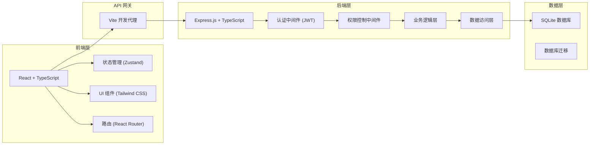
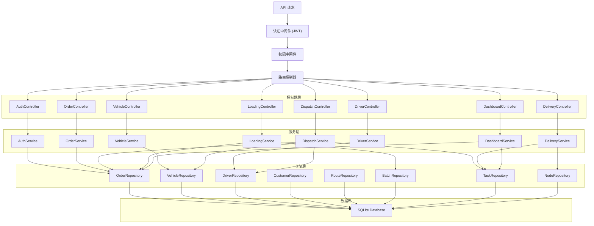
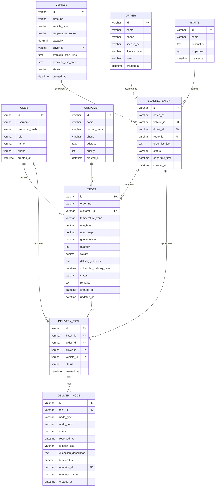

## 1. 架构设计



## 2. 技术描述

- 前端：React@18 + TypeScript + Tailwind CSS@3 + Vite
- 后端：Express@4 + TypeScript
- 数据库：SQLite（轻量级，适合小型企业快速部署）
- 认证：JWT (jsonwebtoken)
- ORM：better-sqlite3（同步 API，简化开发）
- 前端状态管理：Zustand
- 前端路由：react-router-dom
- 图标库：lucide-react
- 初始化工具：vite-init

## 3. 路由定义

### 前端路由

| 路由 | 页面 | 权限 |
|------|------|------|
| /login | 登录页 | 公开 |
| /dashboard | 仪表盘 | 所有登录用户 |
| /orders | 订单列表 | 调度员/管理员 |
| /orders/:id | 订单详情 | 调度员/管理员/司机 |
| /dispatch | 调度中心 | 调度员/管理员 |
| /delivery | 配送执行 | 司机 |
| /loading | 装车管理 | 调度员/管理员 |
| /vehicles | 车辆管理 | 管理员 |
| /drivers | 司机管理 | 管理员 |
| /customers | 客户管理 | 管理员 |
| /routes | 线路管理 | 管理员 |

### 后端 API 路由

| 方法 | 路由 | 模块 | 说明 |
|------|------|------|------|
| POST | /api/auth/login | 认证 | 用户登录 |
| GET | /api/orders | 订单 | 获取订单列表 |
| POST | /api/orders | 订单 | 创建订单 |
| GET | /api/orders/:id | 订单 | 获取订单详情 |
| GET | /api/orders/:id/timeline | 订单 | 获取订单时间线 |
| PUT | /api/orders/:id | 订单 | 更新订单 |
| GET | /api/vehicles | 车辆 | 获取车辆列表 |
| POST | /api/vehicles | 车辆 | 创建车辆 |
| GET | /api/vehicles/available | 车辆 | 获取可用车辆（带时间和温区检查） |
| GET | /api/drivers | 司机 | 获取司机列表 |
| POST | /api/drivers | 司机 | 创建司机 |
| GET | /api/customers | 客户 | 获取客户列表 |
| POST | /api/customers | 客户 | 创建客户 |
| GET | /api/routes | 线路 | 获取线路列表 |
| POST | /api/routes | 线路 | 创建线路 |
| POST | /api/dispatch | 调度 | 创建配送任务（含匹配检查） |
| GET | /api/dispatch/tasks | 调度 | 获取配送任务列表 |
| POST | /api/loading/batches | 装车 | 创建装车批次 |
| POST | /api/loading/batches/:id/confirm | 装车 | 确认批次出库 |
| GET | /api/delivery/tasks | 配送 | 获取司机的配送任务 |
| POST | /api/delivery/nodes/:id/update | 配送 | 更新节点状态 |
| GET | /api/dashboard/stats | 仪表盘 | 获取统计数据 |

## 4. API 定义

### 类型定义

```typescript
// 温区类型
type TemperatureZone = 'frozen' | 'chilled' | 'ambient';

// 订单状态
type OrderStatus = 'created' | 'warehoused' | 'loading' | 'in_transit' | 'delivered' | 'completed' | 'cancelled';

// 节点类型
type NodeType = 'warehouse_in' | 'loading' | 'departure' | 'arrival' | 'delivery' | 'signature';

// 客户
interface Customer {
  id: string;
  name: string;
  contactName: string;
  phone: string;
  address: string;
  priority: number;
  createdAt: string;
}

// 订单
interface Order {
  id: string;
  orderNo: string;
  customerId: string;
  customer: Customer;
  temperatureZone: TemperatureZone;
  minTemp: number;
  maxTemp: number;
  goodsName: string;
  quantity: number;
  weight: number;
  deliveryAddress: string;
  scheduledDeliveryTime: string;
  status: OrderStatus;
  remarks: string;
  createdAt: string;
  updatedAt: string;
}

// 车辆
interface Vehicle {
  id: string;
  plateNo: string;
  vehicleType: string;
  temperatureZones: TemperatureZone[];
  capacity: number;
  driverId?: string;
  availableStartTime: string;
  availableEndTime: string;
  status: 'active' | 'maintenance' | 'disabled';
  createdAt: string;
}

// 司机
interface Driver {
  id: string;
  name: string;
  phone: string;
  licenseNo: string;
  licenseType: string;
  status: 'on_duty' | 'off_duty' | 'on_leave';
  createdAt: string;
}

// 配送线路
interface Route {
  id: string;
  name: string;
  description: string;
  stops: RouteStop[];
  createdAt: string;
}

interface RouteStop {
  order: number;
  address: string;
  estimatedTime: number;
}

// 装车批次
interface LoadingBatch {
  id: string;
  batchNo: string;
  vehicleId: string;
  vehicle: Vehicle;
  driverId: string;
  driver: Driver;
  routeId: string;
  route: Route;
  orderIds: string[];
  orders: Order[];
  status: 'created' | 'loading' | 'departed' | 'completed';
  departureTime?: string;
  createdAt: string;
}

// 配送任务
interface DeliveryTask {
  id: string;
  batchId: string;
  batch: LoadingBatch;
  orderId: string;
  order: Order;
  driverId: string;
  driver: Driver;
  vehicleId: string;
  vehicle: Vehicle;
  status: OrderStatus;
  nodes: DeliveryNode[];
  createdAt: string;
}

// 配送节点
interface DeliveryNode {
  id: string;
  taskId: string;
  nodeType: NodeType;
  nodeName: string;
  status: 'pending' | 'in_progress' | 'completed' | 'exception';
  recordedAt: string;
  locationText: string;
  exceptionDescription?: string;
  temperature?: number;
  operatorId: string;
  operatorName: string;
  createdAt: string;
}

// 调度匹配结果
interface DispatchMatchResult {
  vehicleId: string;
  plateNo: string;
  driverId: string;
  driverName: string;
  temperatureMatch: boolean;
  timeAvailable: boolean;
  conflicts: string[];
  score: number;
}

// 节点更新请求
interface NodeUpdateRequest {
  nodeId: string;
  status: 'completed' | 'exception';
  locationText: string;
  exceptionDescription?: string;
  temperature?: number;
}

// 调度请求
interface DispatchRequest {
  orderIds: string[];
  vehicleId: string;
  driverId: string;
  routeId: string;
  scheduledDepartureTime: string;
}
```

## 5. 服务端架构图



## 6. 数据模型

### 6.1 数据模型 ER 图



### 6.2 DDL 语句

```sql
-- 用户表
CREATE TABLE users (
  id VARCHAR(36) PRIMARY KEY,
  username VARCHAR(50) UNIQUE NOT NULL,
  password_hash VARCHAR(255) NOT NULL,
  role VARCHAR(20) NOT NULL CHECK (role IN ('admin', 'dispatcher', 'driver')),
  name VARCHAR(100) NOT NULL,
  phone VARCHAR(20),
  created_at DATETIME DEFAULT CURRENT_TIMESTAMP
);

-- 客户表
CREATE TABLE customers (
  id VARCHAR(36) PRIMARY KEY,
  name VARCHAR(100) NOT NULL,
  contact_name VARCHAR(50) NOT NULL,
  phone VARCHAR(20) NOT NULL,
  address TEXT NOT NULL,
  priority INTEGER DEFAULT 1,
  created_at DATETIME DEFAULT CURRENT_TIMESTAMP
);

-- 订单表
CREATE TABLE orders (
  id VARCHAR(36) PRIMARY KEY,
  order_no VARCHAR(50) UNIQUE NOT NULL,
  customer_id VARCHAR(36) NOT NULL REFERENCES customers(id),
  temperature_zone VARCHAR(20) NOT NULL CHECK (temperature_zone IN ('frozen', 'chilled', 'ambient')),
  min_temp DECIMAL(5,2) NOT NULL,
  max_temp DECIMAL(5,2) NOT NULL,
  goods_name VARCHAR(200) NOT NULL,
  quantity INTEGER NOT NULL,
  weight DECIMAL(10,2) NOT NULL,
  delivery_address TEXT NOT NULL,
  scheduled_delivery_time DATETIME NOT NULL,
  status VARCHAR(20) NOT NULL DEFAULT 'created' CHECK (status IN ('created', 'warehoused', 'loading', 'in_transit', 'delivered', 'completed', 'cancelled')),
  remarks TEXT,
  created_at DATETIME DEFAULT CURRENT_TIMESTAMP,
  updated_at DATETIME DEFAULT CURRENT_TIMESTAMP
);

-- 车辆表
CREATE TABLE vehicles (
  id VARCHAR(36) PRIMARY KEY,
  plate_no VARCHAR(20) UNIQUE NOT NULL,
  vehicle_type VARCHAR(50) NOT NULL,
  temperature_zones VARCHAR(100) NOT NULL,
  capacity DECIMAL(10,2) NOT NULL,
  driver_id VARCHAR(36) REFERENCES users(id),
  available_start_time TIME NOT NULL,
  available_end_time TIME NOT NULL,
  status VARCHAR(20) NOT NULL DEFAULT 'active' CHECK (status IN ('active', 'maintenance', 'disabled')),
  created_at DATETIME DEFAULT CURRENT_TIMESTAMP
);

-- 司机表
CREATE TABLE drivers (
  id VARCHAR(36) PRIMARY KEY,
  name VARCHAR(100) NOT NULL,
  phone VARCHAR(20) NOT NULL,
  license_no VARCHAR(50) NOT NULL,
  license_type VARCHAR(20) NOT NULL,
  status VARCHAR(20) NOT NULL DEFAULT 'on_duty' CHECK (status IN ('on_duty', 'off_duty', 'on_leave')),
  created_at DATETIME DEFAULT CURRENT_TIMESTAMP
);

-- 线路表
CREATE TABLE routes (
  id VARCHAR(36) PRIMARY KEY,
  name VARCHAR(100) NOT NULL,
  description TEXT,
  stops_json TEXT NOT NULL,
  created_at DATETIME DEFAULT CURRENT_TIMESTAMP
);

-- 装车批次表
CREATE TABLE loading_batches (
  id VARCHAR(36) PRIMARY KEY,
  batch_no VARCHAR(50) UNIQUE NOT NULL,
  vehicle_id VARCHAR(36) NOT NULL REFERENCES vehicles(id),
  driver_id VARCHAR(36) NOT NULL REFERENCES drivers(id),
  route_id VARCHAR(36) NOT NULL REFERENCES routes(id),
  order_ids_json TEXT NOT NULL,
  status VARCHAR(20) NOT NULL DEFAULT 'created' CHECK (status IN ('created', 'loading', 'departed', 'completed')),
  departure_time DATETIME,
  created_at DATETIME DEFAULT CURRENT_TIMESTAMP
);

-- 配送任务表
CREATE TABLE delivery_tasks (
  id VARCHAR(36) PRIMARY KEY,
  batch_id VARCHAR(36) NOT NULL REFERENCES loading_batches(id),
  order_id VARCHAR(36) NOT NULL REFERENCES orders(id),
  driver_id VARCHAR(36) NOT NULL REFERENCES drivers(id),
  vehicle_id VARCHAR(36) NOT NULL REFERENCES vehicles(id),
  status VARCHAR(20) NOT NULL DEFAULT 'created' CHECK (status IN ('created', 'warehoused', 'loading', 'in_transit', 'delivered', 'completed', 'cancelled')),
  created_at DATETIME DEFAULT CURRENT_TIMESTAMP,
  UNIQUE(order_id)
);

-- 配送节点表
CREATE TABLE delivery_nodes (
  id VARCHAR(36) PRIMARY KEY,
  task_id VARCHAR(36) NOT NULL REFERENCES delivery_tasks(id),
  node_type VARCHAR(30) NOT NULL CHECK (node_type IN ('warehouse_in', 'loading', 'departure', 'arrival', 'delivery', 'signature')),
  node_name VARCHAR(100) NOT NULL,
  status VARCHAR(20) NOT NULL DEFAULT 'pending' CHECK (status IN ('pending', 'in_progress', 'completed', 'exception')),
  recorded_at DATETIME,
  location_text VARCHAR(200),
  exception_description TEXT,
  temperature DECIMAL(5,2),
  operator_id VARCHAR(36) REFERENCES users(id),
  operator_name VARCHAR(100),
  created_at DATETIME DEFAULT CURRENT_TIMESTAMP
);

-- 索引
CREATE INDEX idx_orders_customer ON orders(customer_id);
CREATE INDEX idx_orders_status ON orders(status);
CREATE INDEX idx_orders_scheduled ON orders(scheduled_delivery_time);
CREATE INDEX idx_vehicles_status ON vehicles(status);
CREATE INDEX idx_drivers_status ON drivers(status);
CREATE INDEX idx_batches_status ON loading_batches(status);
CREATE INDEX idx_tasks_batch ON delivery_tasks(batch_id);
CREATE INDEX idx_tasks_order ON delivery_tasks(order_id);
CREATE INDEX idx_tasks_driver ON delivery_tasks(driver_id);
CREATE INDEX idx_tasks_status ON delivery_tasks(status);
CREATE INDEX idx_nodes_task ON delivery_nodes(task_id);
CREATE INDEX idx_nodes_recorded ON delivery_nodes(recorded_at);
```

### 6.3 初始数据

```sql
-- 默认用户 (密码: 123456)
INSERT INTO users (id, username, password_hash, role, name, phone) VALUES
('u-admin-001', 'admin', '$2b$10$Ezr4YVxvU5tVJqHmK/8X4OQ5R6Z7Y8X9W7V6U5T4S3R2Q1P0O9N8M7L6K5J4H3G2F1E0D9C8B7A6', 'admin', '系统管理员', '13800000000'),
('u-dispatch-001', 'dispatcher', '$2b$10$Ezr4YVxvU5tVJqHmK/8X4OQ5R6Z7Y8X9W7V6U5T4S3R2Q1P0O9N8M7L6K5J4H3G2F1E0D9C8B7A6', 'dispatcher', '张调度', '13800000001'),
('u-driver-001', 'driver1', '$2b$10$Ezr4YVxvU5tVJqHmK/8X4OQ5R6Z7Y8X9W7V6U5T4S3R2Q1P0O9N8M7L6K5J4H3G2F1E0D9C8B7A6', 'driver', '李司机', '13800000002');

-- 示例客户
INSERT INTO customers (id, name, contact_name, phone, address, priority) VALUES
('cust-001', '永辉超市', '王经理', '13900000001', '北京市朝阳区建国路88号', 1),
('cust-002', '盒马鲜生', '刘主管', '13900000002', '北京市海淀区中关村大街1号', 2),
('cust-003', '7-Eleven', '陈店长', '13900000003', '北京市西城区西单北大街1号', 1);

-- 示例车辆
INSERT INTO vehicles (id, plate_no, vehicle_type, temperature_zones, capacity, driver_id, available_start_time, available_end_time, status) VALUES
('veh-001', '京A12345', '冷藏车', '["frozen","chilled","ambient"]', 5000, NULL, '06:00:00', '22:00:00', 'active'),
('veh-002', '京B67890', '冷冻车', '["frozen","chilled"]', 8000, NULL, '05:00:00', '20:00:00', 'active'),
('veh-003', '京C11111', '保温车', '["chilled","ambient"]', 3000, NULL, '07:00:00', '21:00:00', 'active');

-- 示例司机
INSERT INTO drivers (id, name, phone, license_no, license_type, status) VALUES
('drv-001', '李师傅', '13700000001', '110101199001011234', 'A2', 'on_duty'),
('drv-002', '王师傅', '13700000002', '110101199002022345', 'A1', 'on_duty'),
('drv-003', '张师傅', '13700000003', '110101199003033456', 'A2', 'on_duty');

-- 示例线路
INSERT INTO routes (id, name, description, stops_json) VALUES
('route-001', '朝阳线', '东部区域配送', '[{"order":1,"address":"朝阳区建国路88号","estimatedTime":30},{"order":2,"address":"朝阳区三里屯","estimatedTime":45}]'),
('route-002', '海淀线', '北部区域配送', '[{"order":1,"address":"海淀区中关村大街1号","estimatedTime":40},{"order":2,"address":"海淀区五道口","estimatedTime":35}]');

-- 示例订单
INSERT INTO orders (id, order_no, customer_id, temperature_zone, min_temp, max_temp, goods_name, quantity, weight, delivery_address, scheduled_delivery_time, status, remarks) VALUES
('ord-001', 'ORD20240601001', 'cust-001', 'frozen', -18, -12, '进口牛肉', 100, 500, '北京市朝阳区建国路88号', '2024-06-02 10:00:00', 'created', '需要优先配送'),
('ord-002', 'ORD20240601002', 'cust-002', 'chilled', 2, 8, '新鲜蔬菜', 200, 300, '北京市海淀区中关村大街1号', '2024-06-02 09:00:00', 'created', ''),
('ord-003', 'ORD20240601003', 'cust-003', 'ambient', 15, 25, '常温饮料', 500, 1000, '北京市西城区西单北大街1号', '2024-06-02 14:00:00', 'created', '');
```
